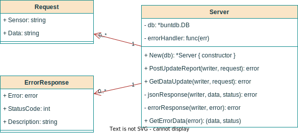

# M242 - LB2

[Setup](01_Setup.md)

[Internet of Things](02_IoT.md)

[REST](03_REST.md)

[C/CPP](04_CTHINGS.md)

[Sensors and Actuators](05_SENSORS.md)

[CORS](06_CORS.md)

[Enabling HTTPS](07_HTTPS.md)

[Service Documentation](08_Service.md)

[IoTKit Documentation](09_IoTKit.md)

[Build & Run It](10_Runit.md)

[Test Protocol](11_Testing.md)

[Reflexion Colin van Loo](12_Reflexion_Colin_van_Loo.md)

[Reflexion Grigory Pavlov](13_Reflexion_Grigory_Pavlov.md)

---

# One Big File

# Table of contents

1. [Setup](#setup)
2. [Internet of Things](#internet-of-things)
3. [REST](#rest)
4. [C/CPP](#c-and-cpp)
5. [Sensors and Actuators](#sensors-1)
6. [CORS](#cross-origin-resource-sharing)
7. [Enabling HTTPS](#https)
8. [Service Documentation](#web-service)
9. [IoTKit Documentation](#iotkit-documentation)
10. [Build & Run It](#build-and-run-the-project)
11. [Test Protocol](#test-protocol)
12. [Reflexion Colin van Loo](#colin-van-loo)
13. [Reflexion Grigory Pavlov](#grigory-pavlov)

# Setup

## Mbed Studio

Install using paru/pacman:

```sh
paru -Syu mbed-studio
```

Alternatively navigate to [Mbed Studio](https://os.mbed.com/studio/) and select
the correct download.

On Linux, mark the downloaded file executable:

```sh
chmod 744 Mbed-Studio-1.4.3.sh
```

And then execute it:

```sh
./Mbed-Studio-1.4.3.sh
```

The installation can take quite some time.

## First Project

Inside the Mbed Studio, click `File` -> `Import Program`. Paste
[https://github.com/iotkitv3/gpio](https://github.com/iotkitv3/gpio) into the
"URL" field. Then click on "Add Program".

Modify the `main.cpp` file like this:

```cpp
/** DigitalOut creates a positive tension on a pin.
*/
#include "BUILD/DISCO_L475VG_IOT01A/ARMC6/mbed_config.h"
#include "mbed.h"

DigitalOut led1(MBED_CONF_IOTKIT_LED1);
DigitalOut led2(MBED_CONF_IOTKIT_LED2);
DigitalOut led3(MBED_CONF_IOTKIT_LED3);
DigitalOut led4(MBED_CONF_IOTKIT_LED4);

DigitalIn usrBtn(MBED_CONF_IOTKIT_BUTTON1);

#define WAIT_TIME 500

int main()
{
    uint8_t counter = 0;

    led1 = 0;
    led2 = 0;
    led3 = 0;
    led4 = 0;

    while (1) 
    {
        uint64_t state = usrBtn.read();
        counter += state;

        if (state > 4) state = 0;

        led1 = (counter >> 0) & 1;
        led2 = (counter >> 1) & 1;
        led3 = (counter >> 2) & 1;
        led4 = (counter >> 3) & 1;

        thread_sleep_for(WAIT_TIME);         
    }
}
```

## Deploy the Program

After a clean build, click the "Run program" button, located right of the
"Clean Build" button. On the top of the screen a notification might appear,
stating that the board needs to be restarted. Simply disconnect and reconnect
the USB cable again.

The application should be executed now, output is written to the serial console
(the window in the bottom part of the screen, labeled
"DISCO\_some\_numbers\_and\_letters").

## Trouble Shooting

Click "Clean Build". The build starts, but after some while prints out:

<samp>
[ERROR] armclang: error: System clock tampering detected. License checkout will fail.
armclang: error: Failed to check out a license.
armclang: note:
Information about this error is available at: http://ds.arm.com/support/lic56/m1004
</samp>

The link that supposedly should be pointing to more information about the error
leads to a 404 page.

Then the compilation fails with:

<samp>
armclang: error: ARM Compiler does not support '-mcpu=cortex-m4'
</samp>

Searching online doesn't help a lot. According to some ARM dev on a forum, they
themselves haven't figured it out yet. The suspected problem is, that during
the build process, a file with a future "mtime" is created. Searching my system
for such a file `find / -newermt '(date "+%Y-%m-%d %I:%M")' -iname "arm"
2>/dev/null` has let to no results.

After some trying out I figured, that you can press "Build" over and over
again. Every time, the building process will continue from where it left off,
until either the "License Check" fails or the build finally completes.

### Update (18.03.2022)

I found out that the error only happens when the IoTKit is connected to the
computer. Simply disconnect the board and the compiler stays happy :-).

# Internet of Things

Groups of devices with sensors and other abilities to connect and exchange data
with other devices and systems over the Internet or other network.

## Sensors

Monitors and measures physical aspects of an environment. Turn physical input
into an electrical output.

## Actuators

Receives an (electrical) signal and performs an action.

# REST

Short for *Re*presentational *S*tate *T*ransfer, builds on top of HTTP.

The HTTP header contains the (request) method and information about the
request/response body, the body contains the actual request/response message.

A client sends requests over HTTP(S) to a server:

```http
GET /api/v3/auth HTTP/1.1
Host: example.com
```

And the server may respond, for example, with JSON in the response body:

```http
HTTP/1.1 200 OK
Access-Control-Allow-Origin: *
Content-Type: application/json

{
    "data": 5,
    "more-data": "hello, world"
}
```

## Request Methods

Describe an action. The most important ones are:

Method | Description
------ | -----------
GET    | Get a resource from the server.
POST   | Send data to be processed on the server.
PUT    | Upload a resource to the server. (Or modify, if the resource already exists.)
DELETE | Delete a resource from the server.

GET and POST are very common, PUT and DELETE are mostly found in file transfer
protocols like "remoteStorage".

## HTTP Requests On the IoTKit

Include the required header files.

```cpp
#include "mbed.h"
#include "http_request.h"
#include "MbedJSONValue.h"

int main(void) {
    // ...
}
```

Connect to WiFi

```cpp
WiFiInterface* network = WiFiInterface::get_default_instance();
if (!network) {
    // Error
}

int ret = network->connect(MBED_CONF_APP_WIFI_SSID, MBED_CONF_APP_WIFI_PASSWORD, NSAPI_SECURITY_WPA_WPA2);
if (ret != 0) {
    // Error
}
```

The call to `get_default_instance` uses the credentials configured in the
`mbed_app.json` file.

```json
{
    "config": {
        "wifi-ssid": {
            "help": "WiFi SSID",
            "value": "\"WLAN_NAME\""
        },
        "wifi-password": {
            "help": "WiFi Password",
            "value": "\"PASSWORD\""
        }
    },
}
```

Make a GET request.

```cpp
HttpRequest* get_req = new HttpRequest(network, HTTP_GET, "http://api.example.com?var=val");
HttpResponse* get_res = get_req->send();

// Clean-up
delete get_req;
```

Make a POST request.

```cpp
HttpRequest* post_req = new HttpRequest(network, HTTP_POST, "http://api.example.com/endpoint");
post_req->set_header("Content-Type", "application/json");
const char body[] = "{\"key\":\"value\"}";
HttpResponse* post_res = post_req->send(body, strlen(body));

// Clean-up
delete post_res;
```

Parse a JSON response.

```cpp
MbedJSONValue parser;
parse(parser, get_res->get_body_as_string().c_str());

std::string val1;
std::string val2;

sunrise = parser["val1"].get<std::string>();
sunset  = parser["val2"].get<std::string>();
```

## Re-using Sockets

Sockets can be re-used to be more resource friendly.

```cpp
// Allows us to re-use the same socket for each request (more resource friendly).
TCPSocket* socket = new TCPSocket();
nsapi_error_t open_result = socket->open(network);
if (open_result != 0)
{ // Error
    printf("Opening Socket Failed: %d\n", open_result);
    return EXIT_FAILURE;
}

nsapi_error_t connect_result = socket->connect(API_BASE);
if (connect_result != 0)
{ // Error
    printf("Connecting to API Failed: %d\n", connect_result);
    return EXIT_FAILURE;
}
```

In network requests, we pass the socket as the first argument, instead of the
network.

```cpp
HttpRequest* post_req = new HttpRequest(socket, HTTP_POST, API_URI);
```

Once we don't need it anymore, we can close and clean it up.

```cpp
socket->close();
delete socket;
```

# C and CPP

## Type Definitions

Use clear types.

```cpp
#include <stdint.h>

uint8_t var1; // unsigned 8-bit int
int32_t var2; // signed 32-bit int
// ...
```

## Return Conventions

Functions _often_ return a positive integer value on success and a negative
value on failure. Some returned objects can also be used as similar to booleans.

```cpp
int32_t ret = some_function_call();
if (ret != 0) {
    // Error
}

SomeObject ret = some_function_call();
if (!ret) {
    // Error
}
```

## Inifinite Loops

```cpp
// Variant 1
while (1) { /* ... */ }

// Variant 2
for (;;) { /* ... */ }
```

## The `using` Keyword

Include something from the standard library.

```cpp
// BAD: imports the entire namespace, can potentially lead to naming conflicts.
using namespace std;

// BETTER: Just import functions that are needed a lot.
using std::printf;

// WITHOUT using
std::printf("Hello, World\n");

// WITH using
printf("Hello, World\n");
```

## Memory Management.

Generally `new` should be pared with `delete` and `malloc` with `free`.

```cpp
T* var = new T // Constructor called.
delete var;    // Destructor called.

void* var = malloc(5); // Raw memory allocated.
free(var);             // Memory freed.
```

Some background:

See [Stackoverflow](https://stackoverflow.com/a/6816851).

Object lifetime in C++ follows: Allocate, Construct, Deconstruct, Deallocate.

`new` allocates and constructs, `delete` destructs and deallocates.
(Technically, `delete` only deallocates, but the compiler usually automatically
inserts a call to the deconstructor.)

```cpp
T* var = (T*)::operator new(sizeof(T)); // Allocate raw memory.
var = new (var) T;                      // Call the constructor.

var->~T();                              // Deconstruct the object.
::operator delete(var);                 // Deallocate the memory.
```

## Function Definitions

In C:

```c
void foo(void) // A function taking _no_ arguments.
void foo()     // An unspecified number of arguments of unspecified type.
```

In C++:

```cpp
void foo(void) // A function taking _no_ arguments. (Same as in C.)
void foo()     // Also a function taking _no_ arguments.
```

# Sensors

## I2C

I-Squared-C, Inter-Integrated Circuit, is a serial databus. It is a
master-slave bus, a data transfer is always initialized by the master (MCU on
the board).

## Get the microprocessor's localtime

First, the time needs to be set. One possibility is to read from the terminal,
if one is connected to the microprocessor:

```cpp
// Read time from terminal.
struct tm t;
printf("Enter current date and time:\n");
printf("YYYY MM DD HH MM SS[Enter]\n");
std:scanf("%d %d %d %d %d %d", &t.tm_year, &t.tm_mon, &t.tm_mday,
    &t.tm_hour, &t.tm_min, &t.tm_sec);

// Values need to be adjusted.
t.tm_year = t.tm_year - 1900;
t.tm_mon = t.tm_mon - 1;

// Set the time.
set_time(mktime(&t));
```

Read the time:

```cpp
// Get and format the time.
time_t unix_seconds = time(NULL);
char time_buffer[32];
strftime(time_buffer, 32, "%H:%M\n", localtime(&unix_seconds));
printf("Current local time: %s", time_buffer);

// Display the time on the OLED screen.
oled.cursor(1, 0);
oled.printf(time_buffer);
```

## LSM6DSL

Accellerator and gyroscope, we use this sensor to measure the tilt of the
microprocessor.

```cpp
#include "LSM6DSLSensor.h"

static LSM6DSLSensor tilt(&devI2c, LSM6DSL_ACC_GYRO_I2C_ADDRESS_LOW);

// Initialize sensor.
tilt.init(NULL);
tilt.enable_g();
tilt.enable_x();
tilt.enable_6d_orientation(); 

// Get the sensor's ID.
tilt.read_id(&id);
printf("LSM6DSL accelerometer & gyroscope = 0x%X\r\n", id);

// Variables to store sensor data in.
uint8_t xl, xh, yl, yh, zl, zh;
xl = xh = yl = yh = zl = zh = 0;

for (;;) {
    // Reead sensor data.
    tilt.get_6d_orientation_xl(&xl);
    tilt.get_6d_orientation_xh(&xh);
    tilt.get_6d_orientation_xl(&yl);
    tilt.get_6d_orientation_yh(&yh);
    tilt.get_6d_orientation_zl(&zl);
    tilt.get_6d_orientation_zh(&zh);
}
```

## HTS221

Measure temperature and humidity.

Initialize the sensor:

```cpp
#if MBED_CONF_IOTKIT_HTS221_SENSOR == true // Sensor supported?
static DevI2C devI2c(MBED_CONF_IOTKIT_I2C_SDA, MBED_CONF_IOTKIT_I2C_SCL);
static HTS221Sensor hum_temp(&devI2c);
#endif

hum_temp.init(NULL);
hum_temp.enable();
```

Read sensor data:

```cpp
float temperature, humidity;
hum_temp.get_temperature(&temperature);
hum_temp.get_humidity(&humidity);

// Data is now stored in the vars temperature and humidity.
```

## BMP180

Can be used to measure air pressure.

```cpp
#include <BMP180Wrapper.h>
static BMP180Wrapper air_pressure(&devI2c);

// Initialize sensor.
air_pressure.init(NULL);
air_pressure.enable();

// Get sensor ID.
air_pressure.read_id(&id);
printf("BMP180 air pressure = 0x%X\r\n", id);

// Variable to store sensor data in.
float pressure;

for (;;) {
    // Read sensor data.
    // NOTE: The method says humidity, but actually reads air pressure in kPa.
    air_pressure.get_humidity(&pressure);
}
```

## APDS-9960

Motion/Gesture sensor.

```cpp
#include "glibr.h"
static glibr gsensor(D14, D15);

// Initialize and enable sensor.
if (gsensor.ginit())
{ // Success
    printf("\nAPDS-9960 initialization completed\r\n");
}
else 
{ // Error
    printf("\nAPDS-9960 initialiaztion ERROR!\r\n");
    return EXIT_FAILURE;
}

if (gsensor.enableGestureSensor(true))
{ // Success
    printf("Gesture sensor is running.\r\n");
}
else
{ // Error
    printf("Gestore sensor ERROR!\r\n");
    return EXIT_FAILURE;
}

// Wait for motion.
if (gsensor.isGestureAvailable() && gsensor.readGesture() != DIR_NONE)
{
    // Motion detected, do something...
}
```

There is a small red LED on the IoTKit, that will turn off whenever a gesture
is detected.

## LIS3MDL

3-axis magnet sensor.

Initialize the sensor:

```cpp
static LIS3MDL magnetometer(&devI2c);
magnetometer.init(NULL);
```

Read sensor data:

```cpp
int32_t axes[3];
magnetometer.get_m_axes(axes);

// Calculatea direction
int diff = axes[0] + axes[1];
diff = (diff < 0) ? diff * -1 : diff;
if  ( diff > 350 && diff < 370 )
    oled.printf( "north %6ld", diff );
else if ( diff > 450 && diff < 470 )
    oled.printf( "west  %6ld", diff );
else if ( diff > 50 && diff < 70 )
    oled.printf( "east  %6ld", diff );
else if ( diff > 130 && diff < 150 )
    oled.printf( "south %6ld", diff );
else
    oled.printf( "      %6ld", diff );
```

## LSM6DSL

3D gyroscope and accellerator sensor.

In this example used to count steps.

Initializ the sensor:

```cpp
static LSM6DSLSensor acc_gyro(&devI2c, LSM6DSL_ACC_GYRO_I2C_ADDRESS_LOW);
acc_gyro.init(NULL);
acc_gyro.enable_x();
acc_gyro.enable_pedometer();
```

Read sensor data:

In this example we count steps.

```cpp
LSM6DSL_Event_Status_t gryo_status;
uint16_t step_count;

acc_gyro.get_event_status(&gyro_status);

if (gyro_status.StepStatus) {
    step_count++;
}
```

Tab detection:

```cpp
acc_gyro.init(NULL);
acc_gyro.enable_x();
acc_gyro.enable_g();
acc_gyro.enable_single_tap_detection();

// ...

LSM6DSL_Event_Status_t gyro_status;
uint16_t tab_count;

acc_gyro.get_event_status(&gyro_status);

if (gyro_status.TapStatus) {
    tap_count++
}
```

# Cross Origin Resource Sharing

Things like `iframe`s make it possible for one website to access another
website. To protect this feature from being misused for evil purposes, CORS was
invented.

## Problem

<sample>
Cross-Origin Request Blocked: The Same Origin Policy disallows reading the
remote resource at http://192.168.104.29:8080/api/v1/data?sensor=hum_temp.
(Reason: CORS request did not succeed). Status code: (null).
</sample>


CORS won't work when testing from `file://`.

## Solution

Run a simple http server:

```sh
python3 -m http.server
```

On the backend, allow all cross origin requests:

```go
// Set CORS header
w.Header().Set("Access-Control-Allow-Origin", "*")
```

Or specify allowed domains:

```go
// Set CORS header
w.Header().Set("Access-Control-Allow-Origin", "https://example.com")
```

# HTTPS

## IoTKit

Enable the IoTKit to use HTTPS.

```cpp
HttpsRequest* post_req = new HttpsRequest(network, SSL_CA_PEM, HTTP_POST, API_URI);
post_req->set_header("Content-Type", "application/json");
const char body[] = "{\"sensor\": \"hum_temp\", \"data\": [34.7, 29.8]}";

HttpResponse* post_res = post_req->send(body, strlen(body));
if (!post_res) {
    // Handle error
}

delete post_req;
```

The constant `SSL_CA_PEM` stores a list of trusted root CAs (Certificate
Authority, issues digital certificates for TLS).

```cpp
const char SSL_CA_PEM[] = "-----BEGIN CERTIFICATE-----\n"
    /* Certificates... */;
    "-----END CERTIFICATE-----\n"
```

## Server

To enable HTTPS on the server side, we need to change the line:

```go
log.Fatal(http.ListenAndServeTLS(":8080", "cert.pem", "key.pem", nil)
```

`cert.pem` and `key.pem` are the respective certificate and private key files.

# Web Service



`Server` provides an endpoint for the IoTKit to send data to
(`PostUpdateReport`), and an endpoint for the client web interface to read data
from (`GetDataUpdate`).

The IoTKit sends `Request`s to the server, where `Sensor` describes the sensor
the data was measured with, and `Data` is the measured data json-encoded.

`ErrorResponse` is returned to the caller in case the request was malformed, or
another error occured.

## Usage

In `main.go`, use the `Server` like this, to configure all necessary endpoints:

```go
func main() {
	db, _ := buntdb.Open(":memory:")
	srv := api.New(db)

	mux := http.NewServeMux()
	mux.Handle(
		"/api/v1/hello_world",
		http.HandlerFunc(func(w http.ResponseWriter, r *http.Request) {
			err := srv.PostUpdateReport(w, r)
			if err != nil {
				log.Printf("Error handling request: %v, %v\n", r, err)
			}
		}))

	mux.Handle(
		"/api/v1/data",
		http.HandlerFunc(func(w http.ResponseWriter, r *http.Request) {
			err := srv.GetDataUpdate(w, r)
			if err != nil {
				log.Printf("Error handling request: %v, %v\n", r, err)
			}
		}))

	fmt.Println("Listening on :8080 ...")
	log.Fatal(http.ListenAndServe(":8080", mux))
}
```

Request handlers can be chained together, for example, to log requests:

```go
func loggingMiddleware(next http.Handler) http.Handler {
	return http.HandlerFunc(func(w http.ResponseWriter, r *http.Request) {
		log.Printf("Request received: %v\n", r)
		next.ServeHTTP(w, r)
	})
}

mux.Handle(
    "/api/v1/hello_world",
    loggingMiddleware(http.HandlerFunc(func(w http.ResponseWriter, r *http.Request) {
        err := srv.PostUpdateReport(w, r)
        if err != nil {
            log.Printf("Error handling request: %v, %v\n", r, err)
        }
    })))
```

## API

The MCU listens to motions, and if detected, sends sensor data to the server in
a request like this:

```sh
curl -i "192.168.65.55:8080/api/v1/hello_world" -X POST\
-H "Content-Type: application/json"\
-d '[{"sensor":"hum_temp","data":"[28.52, 26.5862]"},{"sensor":"tilt","data":"[0, 0, 0, 0, 0, 1]"},{"sensor":"pressure","data":"12.046"}]'
```

The server responds with:

<sample>
HTTP/1.1 200 OK
Date: Sun, 27 Mar 2022 16:30:42 GMT
Content-Length: 0
</sample>


The website (client) will periodically get data from the server using:

```sh
# Temperature and humidity
curl -i "192.168.65.55:8080/api/v1/data?sensor=hum_temp" -X GET
> HTTP/1.1 200 OK
> Access-Control-Allow-Origin: *
> Content-Type: application/json
> Date: Sun, 27 Mar 2022 16:31:21 GMT
> Content-Length: 16
> 
> [28.52, 26.5862]

# Device tilt
curl -i "192.168.65.55:8080/api/v1/data?sensor=tilt" -X GET
> HTTP/1.1 200 OK
> Access-Control-Allow-Origin: *
> Content-Type: application/json
> Date: Sun, 27 Mar 2022 16:31:30 GMT
> Content-Length: 18
> 
> [0, 0, 0, 0, 0, 1]

# Air pressure
curl -i "192.168.65.55:8080/api/v1/data?sensor=pressure" -X GET
> HTTP/1.1 200 OK
> Access-Control-Allow-Origin: *
> Content-Type: application/json
> Date: Sun, 27 Mar 2022 16:31:43 GMT
> Content-Length: 6
> 
> 12.046
```

# IoTKit Documentation

The program is constructed very simple, using only a `main.cpp` file and
running in an infinite loop.

```cpp
// Includes ...

// Constant definitions ...

// Main entry point.
int32_t main(void) {
    // Sensor setup
    hum_temp.init(NULL);
    hum_temp.enable(); 
    // ...

    // Networking setup
    WiFiInterface* network = WiFiInterface::get_default_instance();

    if (!network) {
        printf("ERROR: No WiFiInterface found.\n");
        return EXIT_FAILURE;
    }

    // Infinite loop, read sensor data, send data to server, sleep, repeat.
    for (;;)
    {
        // Read sensor data
        hum_temp.get_temperature(&temperature);
        hum_temp.get_humidity(&humidity);
        // ...

        // Send POST requests
        HttpRequest* post_req = new HttpRequest(network, HTTP_POST, API_URI);
        post_req->set_header("Content-Type", "application/json");
        // ...

        // Clean up resources
        delete post_req;

        // Sleep for 5 seconds
        thread_sleep_for(5000); // milliseconds
    }
}
```

# Build and Run the Project

Start the go web-service:

```sh
cd Server
go run .
```

Then start the web interface using any http server, for example python:

```sh
cd Web
python3 -m http.server
```

Finally, open the `IoTKit` folder in mbed-studio. **Ensure the Wi-fi
credentials in `mbed_app.json` are correct.** Run a `Clean-Build` once. After,
connect the IoTKit, and deploy the application by pressing the `Run` button.

The IoTKit should now be sending data to the webservice.

Console output IoTKit:

<sample>
Connecting to LERNKUBE...SUCCESS
MAC: C4:7F:51:8D:13:58
IP: 192.168.104.23
Humidity & Temperature Sensor = 0xBC
HttpRequest status code: 200
</sample>


Console output web service:

<sample>
Listening on :8080 ... 2022/03/25 11:29:51 Request received: &{POST
/api/v1/hello_world HTTP/1.1 1 1 map[Content-Length:[54]
Content-Type:[application/json]] 0xc0000801c0 <nil> 54 [] false
192.168.104.29:8080 map[] map[] <nil> map[] 192.168.104.23:5669
/api/v1/hello_world <nil> <nil> <nil> 0xc000080200} 2022/03/25 11:29:56 Request
received: &{POST /api/v1/hello_world HTTP/1.1 1 1 map[Content-Length:[54]
Content-Type:[application/json]] 0xc000080400 <nil> 54 [] false
192.168.104.29:8080 map[] map[] <nil> map[] 192.168.104.23:5670
/api/v1/hello_world <nil> <nil> <nil> 0xc000080440}
</sample>


Navigate to the website in your browser. Periodic requests should automatically
update the information displayed.

## Mbed Application Won't Build

Sometimes Mbed-studio doesn't correctly include all libraries. In this case,
switch to the `Libaries` tab and click on all the `!` symbols to install the
libraries.

# Test Protocol

Requirement | Test Description | Expected Result | Result OK? | Comment
----------- | ---------------- | --------------- | ---------- | -------
Motion sensor | Lower or wave hand over MCU. | MCU starts sending data to server, website displays updates. | OK | -
Time\*      | Compare time displayed on webpage with actual time. | The time is correct. | FAILED | Incorrect time on MCU, would neet be by synchronized first, e.g., with NTP.
Tilt\*      | Tilt the board in any direction. | Website displays the angle of tilt. | OK | Direction of tilt can be measured, but not the exact degree.
Temperature\* | Compare displayed temperature with actual temperature. | Temperature is correct. | OK | -
Air Pressure\* | Compare displayed air pressure with actual air pressure. | Air pressure is correct. | OK | -
Humidity\*  | Compare displayed humidity with actual humidity. | Humidity is correct. | OK | -

\* = Depends on motion sensor requirement.

# Reflexionen

## Colin van Loo

I hadn't worked with microprocessors before, and had almost no experience using
C or C++. Luckily there were many good examples explaining how to use and
interact with the different sensors on the IoTKit. I also learned a lot about
C(++) from searching "C Best Practices" on lobste.rs and other places on the
Internet. I've run into many problems with the IoTKit, Sensors not working
correctly -- even when using the example code, -- setting up the network
failing with weird error codes and no further explanation. (After long
searching, I found an error description hidden a way in the libraries source
code.) In the end I managed to solve all those problems and learned many new
things. Programming the MCU was fun, but, besides of `print`s, hard to debug.
That's why I made sure to keep the code as simple as possible. Easier was
programming the webservice, since I could use Go, a language I already had
experience with.

## Grigory Pavlov

Starting this project I had some experience with C++ but not all too much with
microprocessors. Reading the IoTKit documentation helped me a lot to get used
to this unique environment. I liked this project because I work at a company
that deals with IoT/Smart home devices and software and I thought I could learn
some useful things. Initially I had a few problems building libraries in the
Mbed Studio but after getting it to work I could help out Colin with
implementing the wanted functionality. I'm thinking of doing something
microprocessor-related in my free time somewhen in the future.
