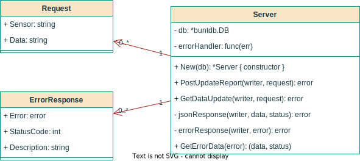

# Web Service



`Server` provides an endpoint for the IoTKit to send data to
(`PostUpdateReport`), and an endpoint for the client web interface to read data
from (`GetDataUpdate`).

The IoTKit sends `Request`s to the server, where `Sensor` describes the sensor
the data was measured with, and `Data` is the measured data json-encoded.

`ErrorResponse` is returned to the caller in case the request was malformed, or
another error occured.

## Usage

In `main.go`, use the `Server` like this, to configure all necessary endpoints:

```go
func main() {
	db, _ := buntdb.Open(":memory:")
	srv := api.New(db)

	mux := http.NewServeMux()
	mux.Handle(
		"/api/v1/hello_world",
		http.HandlerFunc(func(w http.ResponseWriter, r *http.Request) {
			err := srv.PostUpdateReport(w, r)
			if err != nil {
				log.Printf("Error handling request: %v, %v\n", r, err)
			}
		}))

	mux.Handle(
		"/api/v1/data",
		http.HandlerFunc(func(w http.ResponseWriter, r *http.Request) {
			err := srv.GetDataUpdate(w, r)
			if err != nil {
				log.Printf("Error handling request: %v, %v\n", r, err)
			}
		}))

	fmt.Println("Listening on :8080 ...")
	log.Fatal(http.ListenAndServe(":8080", mux))
}
```

Request handlers can be chained together, for example, to log requests:

```go
func loggingMiddleware(next http.Handler) http.Handler {
	return http.HandlerFunc(func(w http.ResponseWriter, r *http.Request) {
		log.Printf("Request received: %v\n", r)
		next.ServeHTTP(w, r)
	})
}

mux.Handle(
    "/api/v1/hello_world",
    loggingMiddleware(http.HandlerFunc(func(w http.ResponseWriter, r *http.Request) {
        err := srv.PostUpdateReport(w, r)
        if err != nil {
            log.Printf("Error handling request: %v, %v\n", r, err)
        }
    })))
```

## API

The MCU listens to motions, and if detected, sends sensor data to the server in
a request like this:

```sh
curl -i "192.168.65.55:8080/api/v1/hello_world" -X POST\
-H "Content-Type: application/json"\
-d '[{"sensor":"hum_temp","data":"[28.52, 26.5862]"},{"sensor":"tilt","data":"[0, 0, 0, 0, 0, 1]"},{"sensor":"pressure","data":"12.046"}]'
```

The server responds with:

<sample>
HTTP/1.1 200 OK
Date: Sun, 27 Mar 2022 16:30:42 GMT
Content-Length: 0
</sample>

The website (client) will periodically get data from the server using:

```sh
# Temperature and humidity
curl -i "192.168.65.55:8080/api/v1/data?sensor=hum_temp" -X GET
> HTTP/1.1 200 OK
> Access-Control-Allow-Origin: *
> Content-Type: application/json
> Date: Sun, 27 Mar 2022 16:31:21 GMT
> Content-Length: 16
> 
> [28.52, 26.5862]

# Device tilt
curl -i "192.168.65.55:8080/api/v1/data?sensor=tilt" -X GET
> HTTP/1.1 200 OK
> Access-Control-Allow-Origin: *
> Content-Type: application/json
> Date: Sun, 27 Mar 2022 16:31:30 GMT
> Content-Length: 18
> 
> [0, 0, 0, 0, 0, 1]

# Air pressure
curl -i "192.168.65.55:8080/api/v1/data?sensor=pressure" -X GET
> HTTP/1.1 200 OK
> Access-Control-Allow-Origin: *
> Content-Type: application/json
> Date: Sun, 27 Mar 2022 16:31:43 GMT
> Content-Length: 6
> 
> 12.046
```
