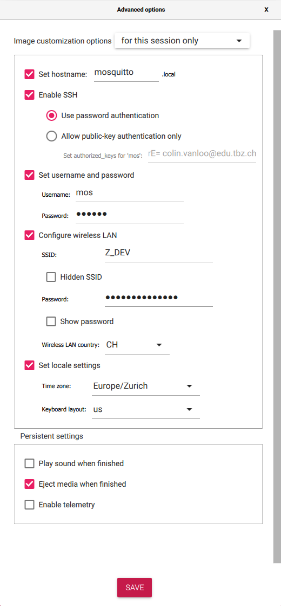

# Mosquitto on a Rasperry Pi 4

## Get the Raspberry Pi Ready

First, download the Raspberry Pi Imager:

```sh
paru -Syu aur/rpi-imager
```

Connect the MicroSD card and start the rpi-imager with root permissions.

```sh
sudo rpi-imager
```

Flash the correct image:

1. Click "Choose OS"
2. Select "Raspberry Pi OS (other)"
3. Select the headless "Raspberry Pi OS Lite (64-bit)"
   Headless means that it does not come with any graphical software like X11.
4. Click "Choose Storage"
5. Select the MicroSD card. Be careful, all data will be lost.

_Before we click "Write," we first need to do some more configuration._

1. Click on the cog symbol on the bottom right.
2. Tick "Set hostname" and enter a suitable name.
3. Tick "Enable SSH" and select "Use password authentication"
   Optionally, you can also use public key authentication.
4. Tick "Set username and password" and choose secure credentials.
5. Tick "Configure wifi" and enter your WIFI credentials. Also select the
   correct WIFI country.
6. Tick "Set locale settings" and leave the defaults.
7. Optionally: Opt-out of telemetry.



Finally, click "Write" and confirm the pop-up.

Eject the flash drive and insert the MicroSD card into the slot on the
Raspberry Pi. Then, connect the RPi's power to turn it on.

Now, find the local IP of your Raspberry Pi. One option is to search on your
router's admin interface for any devices connected with the hostname you've set
when configuring the image.

SSH into the RPi:

```sh
ssh mos@192.168.1.137 # Replace IP with actual IP
```

## Install Mosquitto Broker

Ensure the RPi is up to date.

```sh
sudo apt update && sudo apt upgrade -y
```

Install Mosquitto.

```sh
sudo apt install mosquitto
```

Before any clients can connect, we need to configure a username and password,
and also instruct the broker to listen on a specific port (usually 1883).

```sh
sudo -i # we need to be root
cd /etc/mosquitto
echo "username:password" > passwordfile # create a password file
mosquitto_passwd -U passwordfile # prepare the passwords
```

Edit the `mosquitto.conf` file accordingly.

```sh
vim mosquitto.conf
```

```conf
listener 1883 # allow remote connections on port 1883
allow_anonymous true
password_file /etc/mosquitto/passwordfile # the password file we created earlier
```

Start Mosquitto:

```sh
sudo systemctl enable mosquitto
sudo systemctl start mosquitto
```

## Connect to the Broker from Go

We use the `paho.mqtt.golang` library.

```sh
go get github.com/eclipse/paho.mqtt.golang
```

Configure the client:

```go
opts := &mqtt.ClientOptions{}
opts.SetClientID("GoServer")
opts.SetUsername("mostest")
opts.SetPassword("supersecretpassword")
opts.AddBroker("tcp://192.168.1.137:1883")

client := mqtt.NewClient(opts)
```

Connect to the broker:

```Go
if token := client.Connect(); token.Wait() && token.Error() != nil {
    log.Fatalf("Failed to Connect to MQTT Broker: %v\n", token.Error())
}
```

Subscribe to a topic:

```Go
token := client.Subscribe("IoTKitV3/Temperature", 1, func(c mqtt.Client, m mqtt.Message) {
    log.Printf("Message Received from Broker: %v\n", m)
})
if token.Wait() && token.Error() != nil {
    log.Fatalln("Failed to Subscribe to Topic")
}
```

Publish to a topic:

```Go
token := client.Publish("IoTKitV3/Temperature", 1, true, `{"temp": 28.5, "hum": 30.8`)
if token.Wait() && token.Error() != nil {
    log.Fatalln("Failed to Publish to Topic")
}
```

Note the parameter `1` we passed when subscribing and publishing. This is the
so called "QoS" or Quality of Service parameter.

- 0: Receive a message at most once
- 1: Receive a message at least once
- 2: Receive a message exactly once
